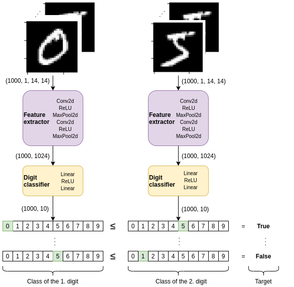

# Mini-project 1 - Classification, weight sharing, auxiliary losses

Project description can be found on this [link](https://fleuret.org/ee559/materials/ee559-miniprojects.pdf).

# Architectures: 
In architectures folder, we have following models for our neural networks. 
- [SimpleConvNet.py](architectures/SimpleConvNet.py) - implementation of a simple convolutional network that is used in the following 4 models as a subnetwork (see image bellow)
- [NoWeightSharing.py](architectures/NoWeightSharing.py) - network without weight sharing
- [NoWeightSharing_AuxLosses.py](architectures/NoWeightSharing_AuxLosses.py) - network without waight sharing and using auxilliary losses for the training
- [WeightSharing.py](architectures/WeightSharing.py) - network with weight sharing (Siamese)
- [WeightSharing_AuxLosses.py](architectures/WeightSharing_AuxLosses.py) - network with weight sharing (Siamese) and using auxilliary losses for the training

The architecture of the Simple Convolutional Network for digit classification can be seen in the following image:

# Dataset:
In dataset folder, you can see the python script for creating the dataset that we used in training and test. 
- [CustomDataset.py](dataset/CustomDataset.py) - data generator used for creating training and testing datasets

# Running model in VM
In order to run our model in VM, you type `python test.py`. This will give result for the one network defined above (by default it is `NETWORK=1`). You can change the `NETWORK` parameter inside `test.py` according to the network model that you wanna run. You can find the values for that parameter as following:  
1 - SimpleConvNet  
2 - WeightSharing  
3 - WeightSharingAuxLosses  
4 - NoWeightSharing  
5 - NoWeightSharingAuxLosses  
